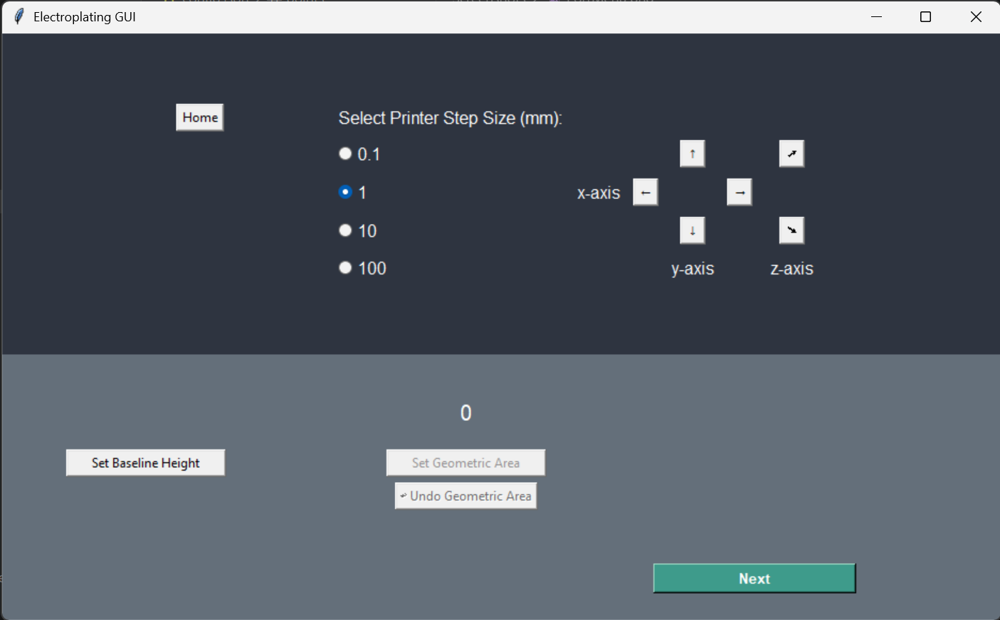
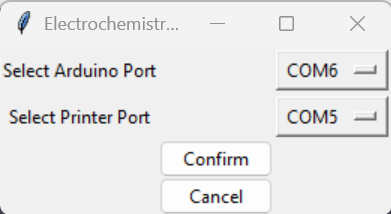
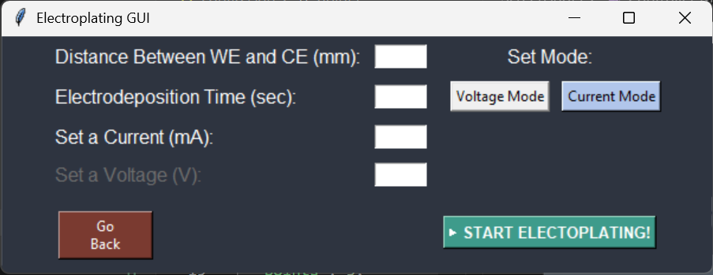
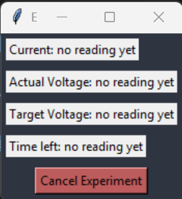

<div align="center">
	<h1>ECRIT Electroplating System</h1>


[](https://opensource.org/licenses/MIT)
</div>

## Table of Contents <!-- omit from toc -->
- [About Ecrit](#about-ecrit)
- [Prerequisites](#prerequisites)
- [Installation](#installation)
- [Usage](#usage)
- [License](#license)

## About Ecrit
This is a system for controlling an electroplating experiment using a 3D printer and Arduino Uno.

## Prerequisites
1. Ensure you have Python installed on your system. You can download it from [python.org](https://www.python.org/downloads/).
2. Download and install the arduino IDE from [arduino.cc](https://www.arduino.cc/en/software/)

## Installation
### Set Up UI
1. Clone the repository.
```bash
git clone https://github.com/Bruce-Research-Group/ECRIT
```
2. Install the required Python packages:
```bash
pip install -r requirements.txt
```
3. Make gui file executable:
```bash
chmod +x SendCommandSerial.py
```
3. To run the gui and to view it, run the following command in the terminal or open "SendCommandSerial.py" through the file explorer
```bash
./SendCommandSerial.py
```

### Set Up Arduino
1. Open the arduino IDE
2. Click File
3. Click Open File and find the cloned repository from the UI setup.
4. Open the Eletroplating_Serial_R4 folder and open the "Electroplating_Serial_R4.ino" file within
5. After the file opens, select the arduino board and upload the code to the board. For further information on how to do so use the guide linked [here](https://support.arduino.cc/hc/en-us/articles/4733418441116-Upload-a-sketch-in-Arduino-IDE)

## Usage
- A GUI to conduct electroplating experiments easily
- A analysis-tool for quick access to experiment data / information

1. Upon starting the program you are presented with the following start menu. To begin click "Start" to start the program.


2. If successful, the program will open to the controller menu. Here start by clearing any possible obstructions out of the way of your 3D printer, then click the home button to ensure your printer starts at the right position.



**Troubleshooting**: If this operation does not result in any change in the 3D printer; you may have to restart the program and click the configure ports button instead. Click the dropdown to select your corresponding arduino and 3D printer ports. Then click the confirm button to complete the port selection. After successfully updating your ports, click the "Start" button on the start menu.



Ensure that your experimental apparatus is setup according to the procedure given in the research paper.
The up and down arrows labeled "z-axis" are used to move the printer head up and down. The "y-axis controls forwards and backwards and the "x-axis controls left and right. Under the “Select Printer Step Size” option, whatever number you choose determines the travel distance of the platinum electrode or the cell.

WARNING: If the number you choose from the “Select Printer Step Size” is more than the distance between your electrode and your cell, the electrode will crash into the cell. 

3. Now use the arrow buttons to position the electrode attached to the printer head such that it touches the geometric surface area on the substrate, then click "Set Baseline Height" abd also click set geometric area.
4. If you have multiple geometric surface areas on the substrate and your objective is to perform rasterable electrodeposition, use the arrow buttons to position the electrode perpendicularly to the next geometric surface area and click "Set Geometric Area". Repeat the perpendicular position setting and the "Set Geometric Area" for all the surface areas on the substrate.
5. Click Next.
6. Select Voltage or Current Mode for constant current or contant voltage.



7. The following experimental variables will be registered in the boxes (a) Input values for the distance between electrode and substrate (in millimeters). (b) The time the experiment should take at each point (in seconds). (c) Set either the current in milliAmperes or voltage in volts.
8. Click "START ELECTROPLATING"
9. Wait for the experiment to start and monitor the real-time results.



## License 
- Bruce Research Group
[](https://opensource.org/licenses/MIT)
